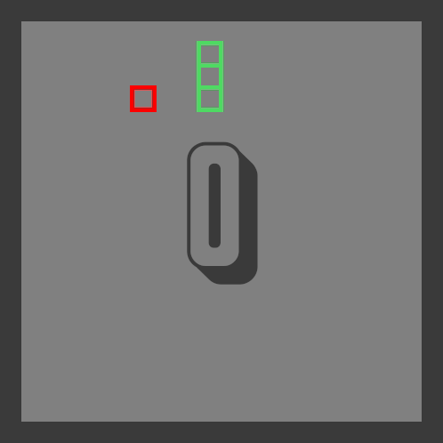

# Snake

[](https://github.com/tterb/atomic-design-ui/blob/master/LICENSEs)

A simple (but polished) implementation of the Snake game in Rust.
Made with the intention of getting used to Rust as well as the graphics libraries available for it.


<p align="center">
          
</p>

## Tested On

- [ ]  Windows
- [ ]  macOS
- [x]  Linux (Pop!_OS 20.04 LTS)

## Installation

Install my-project with git and cargo (cargo and rust can both be installed using rustup)
```bash
    git clone https://github.com/shaleen111/snake-rust.git
    cd snake
    cargo build --release
```
## Usage/Examples

```
  cargo run
```
## Roadmap

- [x]  Core Gameplay
- [x]  Port from Piston to ggez
- [x]  Screen Shake Effect
- [x]  Audio
- [ ]  CRT Effect with Shaders
